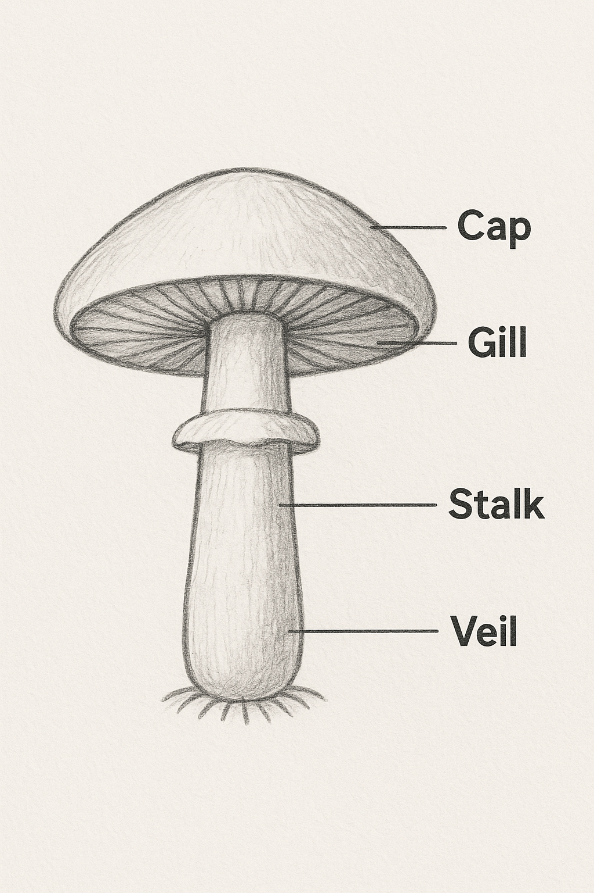
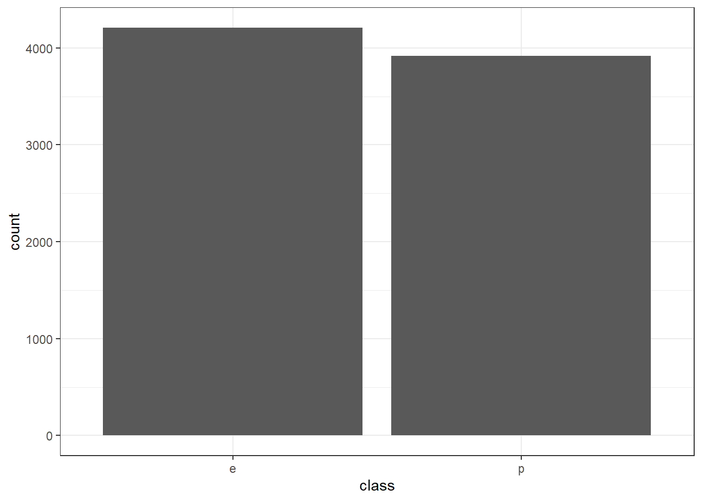
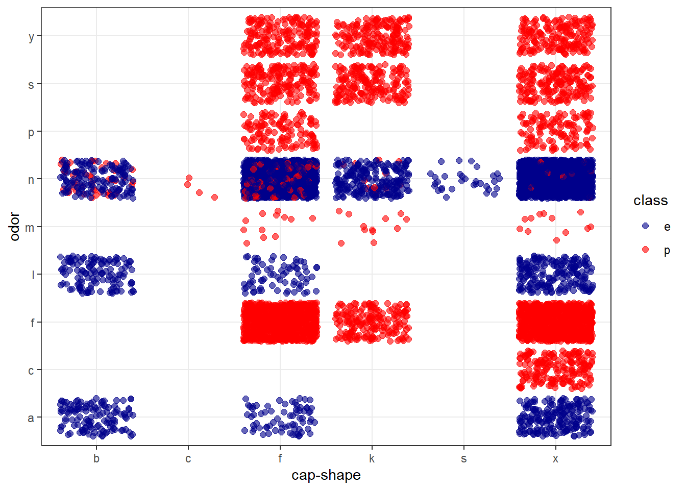
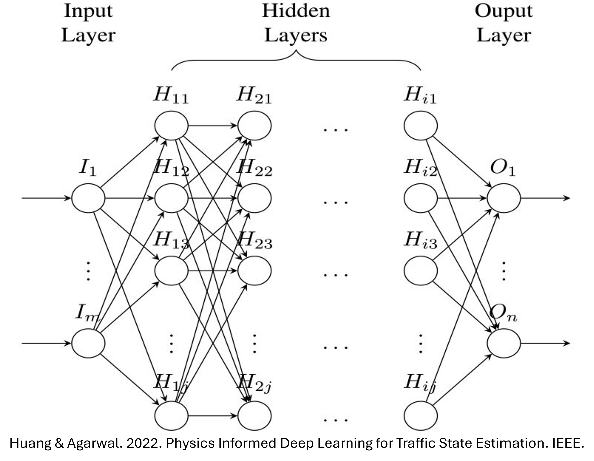
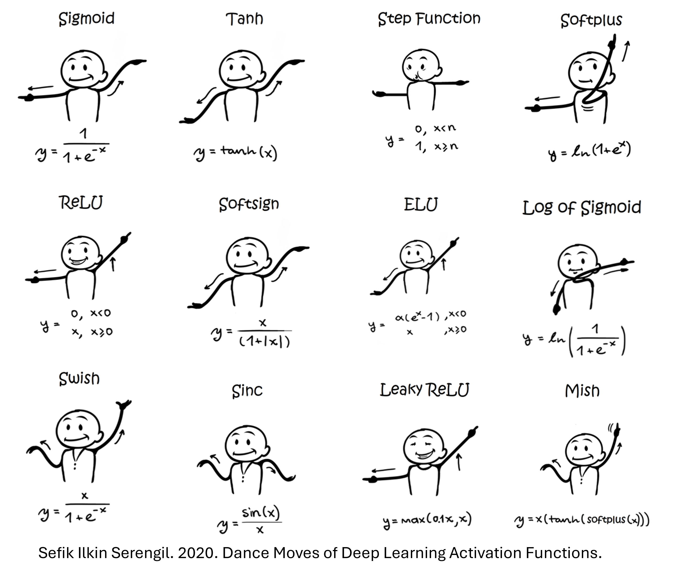

# Deep Learning in Ecology 🧠🍄

This exercise conveys the basic setup, training, validation and evaluation procedure for deep neural networks. It targets on an ecology-trained audience and therefore, may be simplifying and not always technically comprehensive. The pre-setup deep learning model was implemented with pytorch in python and uses a small data set to ensure that all participants can run the model on their own computers. The model design is simple, but enables participants to tweak essential hyperparameters and observe changes in the performance of the model. Especially the code was programmed together with ChatGPT. If participants have any questions after the course, they can seek support from ChatGPT or any other AI tool **while keeping in mind to critically reflect and question AI answers.**

## Setting up Python on your computer and in RStudio 🐍💻

Please execute the individual steps of the checklist in the specified order to set up Python on your computer and enable its integration in RStudio and Markdown documents.

-   [ ] Install the **current version of Python** from [here](https://www.python.org/downloads/)

-   [ ] Install the **required Python packages** using pip:

1\. Open python in the **terminal** of either RStudio or your computer by simply executing the command `python` in the terminal.

2\. Install **pytorch** for building deep learning models by running the following command `pip3 install torch torchvision --index-url https://download.pytorch.org/whl/cu126`

3\. Install **matplotlib** for creating plots by running the following command `pip3 install matplotlib`

4\. Install **numpy** for mathematical operations by running the following command `pip3 install numpy`

5\. Install **pandas** for handling data frames by running the following command `pip3 install pandas`

⚠️If pip wasn't installed with Python, follow the instructions on how to install pip [here](https://www.geeksforgeeks.org/installation-guide/how-to-install-pip-on-windows/).

-   [ ] Install the **required R packages** by running the following code chunk:


    ::: {.cell}
    
    ```{.r .cell-code}
    install.packages(c("png","RcppTOML", "reticulate"))
    ```
    :::


-   [ ] Then run the next code chunk too:


    ::: {.cell}
    
    ```{.r .cell-code}
    library(reticulate)
    ```
    :::


    If you receive an error/warning message because **{reticulate} cannot find** your Python programme,

1\. Open the **terminal** and run the command `python -c "import sys; print(sys.version); print(sys.executable)"` to get the path of your current python version.

2\. Plug in the path to your python version in the following code chunk and run it.


::: {.cell}

```{.r .cell-code}
reticulate::use_python(PATH/TO/PYTHON) #Enter the correct path to your python version
```
:::


Now you should be ready to run python and train deep learning models in RStudio using Markdown files! 🎉

## The Deep Learning task and data set 🎯💾

For reasons of practicability, we want to train a simple DL model for a binary classification task that decides if a mushroom is edible or poisonous based on its morphological characteristics. Therefore, we will use a openly published data set on mushroom classification from [kaggle](https://www.kaggle.com/datasets/uciml/mushroom-classification?resource=download).

{fig-align="center"}

Let's first get a better feeling for our data set using our usual R tools:


::: {.cell inlcude='false'}

```{.r .cell-code}
library(here)
library(tidyverse)
library(reticulate)

reticulate::use_python("C:/Users/bt308479/AppData/Local/Programs/Python/Python312",
                       required = TRUE)
```
:::

::: {.cell}

```{.r .cell-code}
#load the dataset
dat <- readr::read_csv(here("Data", 
                            "Input", 
                            "mushrooms.csv"))
head(dat)
```

::: {.cell-output .cell-output-stdout}
```
# A tibble: 6 × 23
  class `cap-shape` `cap-surface` `cap-color` bruises odor  `gill-attachment`
  <chr> <chr>       <chr>         <chr>       <lgl>   <chr> <chr>            
1 p     x           s             n           TRUE    p     f                
2 e     x           s             y           TRUE    a     f                
3 e     b           s             w           TRUE    l     f                
4 p     x           y             w           TRUE    p     f                
5 e     x           s             g           FALSE   n     f                
6 e     x           y             y           TRUE    a     f                
# ℹ 16 more variables: `gill-spacing` <chr>, `gill-size` <chr>,
#   `gill-color` <chr>, `stalk-shape` <chr>, `stalk-root` <chr>,
#   `stalk-surface-above-ring` <chr>, `stalk-surface-below-ring` <chr>,
#   `stalk-color-above-ring` <chr>, `stalk-color-below-ring` <chr>,
#   `veil-type` <chr>, `veil-color` <chr>, `ring-number` <chr>,
#   `ring-type` <chr>, `spore-print-color` <chr>, population <chr>,
#   habitat <chr>
```
:::
:::


Our edible or poisonous mushrooms (column ***class***) are described by 22, mostly morphological characteristics, that are categories and a bit cryptic. In the description of the data set they are explained in more detail:

{fig-align="center" width="189"}

Attribute Information: (classes: edible=e, poisonous=p)

-   cap-shape: bell=b,conical=c,convex=x,flat=f, knobbed=k,sunken=s

-   cap-surface: fibrous=f,grooves=g,scaly=y,smooth=s

-   cap-color: brown=n,buff=b,cinnamon=c,gray=g,green=r,pink=p,purple=u,red=e,white=w,yellow=y

-   bruises: bruises=t,no=f

-   odor: almond=a,anise=l,creosote=c,fishy=y,foul=f,musty=m,none=n,pungent=p,spicy=s

-   gill-attachment: attached=a,descending=d,free=f,notched=n

-   gill-spacing: close=c,crowded=w,distant=d

-   gill-size: broad=b,narrow=n

-   gill-color: black=k,brown=n,buff=b,chocolate=h,gray=g, green=r,orange=o,pink=p,purple=u,red=e,white=w,yellow=y

-   stalk-shape: enlarging=e,tapering=t

-   stalk-root: bulbous=b,club=c,cup=u,equal=e,rhizomorphs=z,rooted=r,missing=?

-   stalk-surface-above-ring: fibrous=f,scaly=y,silky=k,smooth=s

-   stalk-surface-below-ring: fibrous=f,scaly=y,silky=k,smooth=s

-   stalk-color-above-ring: brown=n,buff=b,cinnamon=c,gray=g,orange=o,pink=p,red=e,white=w,yellow=y

-   stalk-color-below-ring: brown=n,buff=b,cinnamon=c,gray=g,orange=o,pink=p,red=e,white=w,yellow=y

-   veil-type: partial=p,universal=u

-   veil-color: brown=n,orange=o,white=w,yellow=y

-   ring-number: none=n,one=o,two=t

-   ring-type: cobwebby=c,evanescent=e,flaring=f,large=l,none=n,pendant=p,sheathing=s,zone=z

-   spore-print-color: black=k,brown=n,buff=b,chocolate=h,green=r,orange=o,purple=u,white=w,yellow=y

-   population: abundant=a,clustered=c,numerous=n,scattered=s,several=v,solitary=y

-   habitat: grasses=g,leaves=l,meadows=m,paths=p,urban=u,waste=w,woods=d

Let's check how big our data set is and if we can already identify some common pattern:


::: {.cell}

```{.r .cell-code}
#plot a histogram of our two classes
dat %>%
  ggplot(mapping = aes(x = class))+
   geom_histogram(stat = "count")+
   theme_bw()
```

::: {.cell-output .cell-output-stderr}
```
Warning in geom_histogram(stat = "count"): Ignoring unknown parameters:
`binwidth`, `bins`, and `pad`
```
:::

::: {.cell-output-display}
{width=672}
:::
:::


We have about 8,000 entries with nearly as many edible as poisonous mushrooms which is a solid basis to start with.


::: {.cell}

```{.r .cell-code}
ggplot(data = dat, aes(x = `cap-shape`, y = odor, col = class))+
  geom_jitter(size = 2, alpha = 0.6, width = 0.4, height = 0.4)+
  scale_colour_manual(values= c("e" = "darkblue", "p" = "red"))+
  theme_bw()
```

::: {.cell-output-display}
{width=672}
:::
:::


There seems to be a correlative pattern between different characteristics and edible vs poisonous mushrooms. Thus, our task should be achievable. Let's try! 🤓

## Model set up, training and validation 😮‍💨

### Preprocessing of the data


::: {.cell}

```{.python .cell-code}
import pandas as pd
import numpy as np
import torch
import torch.nn as nn
from torch.utils.data import Dataset, DataLoader, TensorDataset
from sklearn.model_selection import train_test_split
from sklearn.metrics import confusion_matrix, accuracy_score, precision_score, recall_score
import matplotlib.pyplot as plt
from typing import List, Dict
```
:::


We have to encode the categories using integers so that the we can pass a numerical data frame to the DL model. For our binary prediction aim, we encode our edible or poisonous class in 0 or 1. We can easily do this in R.


::: {.cell}

```{.r .cell-code}
dat_num <- dat %>%
    dplyr::mutate(class = purrr::map_dbl(
      .x = class,                             #encode edible mushrooms as 0 and
      .f = ~ifelse(.x == "e", return(0), return(1)) #poisonous mushrooms as 1
    ))
head(dat_num)
```

::: {.cell-output .cell-output-stdout}
```
# A tibble: 6 × 23
  class `cap-shape` `cap-surface` `cap-color` bruises odor  `gill-attachment`
  <dbl> <chr>       <chr>         <chr>       <lgl>   <chr> <chr>            
1     1 x           s             n           TRUE    p     f                
2     0 x           s             y           TRUE    a     f                
3     0 b           s             w           TRUE    l     f                
4     1 x           y             w           TRUE    p     f                
5     0 x           s             g           FALSE   n     f                
6     0 x           y             y           TRUE    a     f                
# ℹ 16 more variables: `gill-spacing` <chr>, `gill-size` <chr>,
#   `gill-color` <chr>, `stalk-shape` <chr>, `stalk-root` <chr>,
#   `stalk-surface-above-ring` <chr>, `stalk-surface-below-ring` <chr>,
#   `stalk-color-above-ring` <chr>, `stalk-color-below-ring` <chr>,
#   `veil-type` <chr>, `veil-color` <chr>, `ring-number` <chr>,
#   `ring-type` <chr>, `spore-print-color` <chr>, population <chr>,
#   habitat <chr>
```
:::

```{.r .cell-code}
readr::write_csv(dat_num, 
                 here("Data", 
                      "Processed",
                      "mushrooms_numerical.csv"))
```
:::


All other categorical columns will be one-hot encoded, which creates for each column a vector which is as long as the number of categories. Each position in the vector represents one of the categories and is 1 if the mushroom has the represented category while all other vector positions will be 0. For this encoding, we will switch to python because it already provides the required functions.


::: {.cell}

```{.python .cell-code}
#load the data set into the python environment
df = pd.read_csv("C:/Users/bt308479/Documents/GIT/SSoQE-Deep_Learning_in_Ecology/Data/Processed/mushrooms_numerical.csv")

#select the columns that still have to be hotencoded
df_to_encode = df.drop(["class", "bruises"], axis=1)

print(df_to_encode.head())
```

::: {.cell-output .cell-output-stdout}
```
  cap-shape cap-surface cap-color  ... spore-print-color population habitat
0         x           s         n  ...                 k          s       u
1         x           s         y  ...                 n          n       g
2         b           s         w  ...                 n          n       m
3         x           y         w  ...                 k          s       u
4         x           s         g  ...                 n          a       g

[5 rows x 21 columns]
```
:::
:::

::: {.cell}

```{.python .cell-code}
#hot-encode the categorical columns using a pandas costum function
df_hotencoded = pd.get_dummies(df_to_encode)

print(df_hotencoded.head())
```

::: {.cell-output .cell-output-stdout}
```
   cap-shape_b  cap-shape_c  cap-shape_f  ...  habitat_p  habitat_u  habitat_w
0        False        False        False  ...      False       True      False
1        False        False        False  ...      False      False      False
2         True        False        False  ...      False      False      False
3        False        False        False  ...      False       True      False
4        False        False        False  ...      False      False      False

[5 rows x 115 columns]
```
:::
:::


Now, you can see that our hot-encoded data frame suddenly has 115 columns. Each column represents an individual category within the different morphological characteristics and is TRUE if this characteristic was observed at our mushroom.


::: {.cell}

```{.python .cell-code}
#save the classes to be predicted in a seperate variable
out = df["class"]

#and add the boolean column "bruises" to the hot encoded categories
inp = df_hotencoded.copy()
inp["bruises"] = df["bruises"]
```
:::


### Split data into train, validation and test data

In order to improve our model design, we will repeatedly train and validate our model which requires two different data sets. The **training data** **set** is used to fit the model parameters. To avoid overfitting, i.e. the models learns all specifics of the training data well but fails to generalise and predict correctly on different data, we validate the performance of the model with the **validation data** **set**. After finishing the training-validation loop, we will evaluate the final model performance on a third data set that it hasn't seen before, which is the **test data set**. The size distribution of the data sets is usually:

-   training data set: model fitting (\~60% of the data)

-   validation data: hyper parameter tuning (\~20% of the data)

-   test data: model evaluation (\~20% of the data)


::: {.cell}

```{.python .cell-code}
#first split: 60% train, 40% temp
inp_train, inp_temp, out_train, out_temp = train_test_split(inp, out, test_size = 0.4, random_state = 42, stratify = out) #random_state ensures reproducibility, stratify the preservation 

#second split: split thr 40% temp into 20% validation and 20% test data
inp_val, inp_test, out_val, out_test = train_test_split(inp_temp, out_temp, test_size = 0.5, random_state = 42, stratify = out_temp)

# Convert to PyTorch tensors
inp_train = torch.tensor(inp_train.values, dtype=torch.float32)
out_train = torch.tensor(out_train.values, dtype=torch.long)

inp_val   = torch.tensor(inp_val.values, dtype=torch.float32)
out_val   = torch.tensor(out_val.values, dtype=torch.long)

inp_test  = torch.tensor(inp_test.values, dtype=torch.float32)
out_test  = torch.tensor(out_test.values, dtype=torch.long)

# Quick check
print("Train:", inp_train.shape, out_train.shape)
```

::: {.cell-output .cell-output-stdout}
```
Train: torch.Size([4874, 116]) torch.Size([4874])
```
:::

```{.python .cell-code}
print("Val:  ", inp_val.shape, out_val.shape)
```

::: {.cell-output .cell-output-stdout}
```
Val:   torch.Size([1625, 116]) torch.Size([1625])
```
:::

```{.python .cell-code}
print("Test: ", inp_test.shape, out_test.shape)
```

::: {.cell-output .cell-output-stdout}
```
Test:  torch.Size([1625, 116]) torch.Size([1625])
```
:::
:::


### Build a simple, densely connected deep learning model

Now, we have to make several model decisions:

1.  **How many layers** should our deep learning model have and what's the **size**, i.e. the number of nodes, of each of them?

    

Here a few rules of thumb:

-   The input layer has usually as many nodes as there are features in our input data. Currently, our input data set has 116 columns. In consequence, we will put 116 nodes in our input layer.

-   For the size of the hidden layers, we will just choose a random number. Classically, programmers choose a power of 2. The more nodes, the more complex patterns our model could potentially recognise, but also the chance for overfitting is increasing. You can make the hidden layers smaller towards the output layer so that we have a progressive compaction of information.

-   The size of the output layer depends on the task. As we have a binary classification task, we will simply choose one node that basically says "yes" or "no". If we had multiple classes, we'd choose one node per class.

1.  Which **activation functions** should we use for each layer?



The activation functions introduce non-linearity in our model. (Leaky)ReLU is a classical choice. Especially, the activation function behind the output layer is crucial because it depends once more on your classification task. For our binary classification task, we want a probability ranging between 0 and 1. For this purpose Sigmoid is a typical choice.


::: {.cell}

```{.python .cell-code}

input_size = inp_train.shape[1]  # number of one-hot features
hidden_size = 64                 # a random power of two that it's not too big
output_size = 1

model = nn.Sequential(
  #definition of input layer, nn.Linear is a fully connected layer, the first parameter defines the number of input nodes, the second the number of output nodes to which the input nodes are connected
    nn.Linear(input_size, hidden_size),
  #non-linear activation function, LeakyReLU allows a small gradient when the input is negative
    nn.LeakyReLU(),
    nn.Linear(hidden_size, hidden_size),           # hidden → hidden
    nn.LeakyReLU(),
    nn.Linear(hidden_size, output_size),            # hidden → output
    #activation function for binary classificaiton; returns probability value between 0 and 1, where 0 means it's definetly edible and 1 it's for sure poisnous
    nn.Sigmoid()                 
)
```
:::


### Tweaking hyperparameters

Besides the model architecture, we have to define further parameters that specify how we measure the correctness of the models prediction and how it learns. Essential parameters are:

-   **Loss function:** The loss function measures the difference between the classes predicted by our model and the real classes in our data. For binary classification tasks a typical function is the Binary Cross Entropy Loss.

-   **Optimizer:** The optimizer regulates the updating procedure of the weights and biases of each node in our deep learning model. Let's have a simple example: Remember that each node in our input layer represents one of our columns in the input data, i.e. one feature. Some of these features may be more important for the correct prediction of edible vs poisonous mushrooms. The weights regulate which of these nodes are more important. And the bias may be a correction required. Each time the optimizer updates the weights and biases of the nodes, the loss measured by the loss function should be reduced until we reach the optimum. This procedure is also called backward propagation.


-   **Learning rate:** The learning rate controls the magnitude of the optimizer update. The smaller it is, the longer it takes to reach the minimum of the loss. However, if the learning rate is too big, we might miss the optimum. **Nowadays, we can use a Stochastic Gradient Descent algorithm that adapts its own learning rate dynamically.**

-   **Batch size:** A batch is a subset of our training data of which the loss is calculated and based on which the optimizer updates weights and biases. The smaller the batches, the more variable the optimisation procedure.

-   **Number of epochs:** One epoch ends, if all training data has been used for optimisation. At the end of an epoch the training data set is compared against the validation data set. A higher number of epoch means a longer training procedure and contains the risk of over fitting. While few epochs may prevent to reach the minimal loss.

-   **Training vs Validation loss:** If both decrease, our model performance is improving. If the training loss decreases but the validation loss is increasing, we overfit. If both losses keep constantly high, we underfit.

-   **Early stopping:** The idea of early stopping is to end the model training once the validation loss hasn't been improving for a certain number of epochs. Thereby, we can prevent overfitting and save computational time.

-   **Complexity:** The more and the bigger the hidden layers, the more complex patterns are learned by the model which can lead to overfitting.


::: {.cell}

```{.python .cell-code}
loss_function = nn.BCELoss()
learning_rate = 0.001
optimizer = torch.optim.SGD(model.parameters(), lr = learning_rate)
epochs = 5
bsize = 8000                 #batch size

train_dataset = TensorDataset(inp_train, out_train)
val_dataset = TensorDataset(inp_val, out_val)

train_loader = DataLoader(train_dataset, batch_size = bsize, shuffle = True)
val_loader = DataLoader(val_dataset, batch_size = bsize)
```
:::


### Train the model

⚠️ **Note:** Executing this code chunk repeatedly will always train our previously set-up model further. If you want to restart training your model from the very beginning, you'll have to rerun the code-chunk in which we set up the model.


::: {.cell}

```{.python .cell-code}
train_losses = []
val_losses = []

#procedure conducted for each epoch
for epoch in range(epochs):
    model.train()
    running_loss = 0.0

  #procedure conducted for each batch that's created by the train_loader
    for X_batch, y_batch in train_loader:
        #model prediction on the current training batch
        outputs = model(X_batch).squeeze()
        #loss computed based on the model prediction and the true labels
        loss = loss_function(outputs, y_batch.float()) 
        
        #backward propagation that updates the weights and biases in the DL model
        optimizer.zero_grad()
        loss.backward() 
        optimizer.step()
        
        running_loss += loss.item()
    
    avg_train_loss = running_loss / len(train_loader)
    train_losses.append(avg_train_loss)

  #Validation
    model.eval()
    val_loss = 0.0
    with torch.no_grad():
      #computing validation loss for each batch
        for X_batch, y_batch in val_loader:
            outputs = model(X_batch).squeeze()
            loss = loss_function(outputs, y_batch.float())
            val_loss += loss.item()
    avg_val_loss = val_loss / len(val_loader)
    val_losses.append(avg_val_loss)

    print(f"Epoch {epoch+1}: Train Loss={avg_train_loss:.4f}, Val Loss={avg_val_loss:.4f}")
```

::: {.cell-output .cell-output-stdout}
```
Sequential(
  (0): Linear(in_features=116, out_features=64, bias=True)
  (1): LeakyReLU(negative_slope=0.01)
  (2): Linear(in_features=64, out_features=64, bias=True)
  (3): LeakyReLU(negative_slope=0.01)
  (4): Linear(in_features=64, out_features=1, bias=True)
  (5): Sigmoid()
)
Sequential(
  (0): Linear(in_features=116, out_features=64, bias=True)
  (1): LeakyReLU(negative_slope=0.01)
  (2): Linear(in_features=64, out_features=64, bias=True)
  (3): LeakyReLU(negative_slope=0.01)
  (4): Linear(in_features=64, out_features=1, bias=True)
  (5): Sigmoid()
)
Epoch 1: Train Loss=0.6968, Val Loss=0.6970
Sequential(
  (0): Linear(in_features=116, out_features=64, bias=True)
  (1): LeakyReLU(negative_slope=0.01)
  (2): Linear(in_features=64, out_features=64, bias=True)
  (3): LeakyReLU(negative_slope=0.01)
  (4): Linear(in_features=64, out_features=1, bias=True)
  (5): Sigmoid()
)
Sequential(
  (0): Linear(in_features=116, out_features=64, bias=True)
  (1): LeakyReLU(negative_slope=0.01)
  (2): Linear(in_features=64, out_features=64, bias=True)
  (3): LeakyReLU(negative_slope=0.01)
  (4): Linear(in_features=64, out_features=1, bias=True)
  (5): Sigmoid()
)
Epoch 2: Train Loss=0.6968, Val Loss=0.6969
Sequential(
  (0): Linear(in_features=116, out_features=64, bias=True)
  (1): LeakyReLU(negative_slope=0.01)
  (2): Linear(in_features=64, out_features=64, bias=True)
  (3): LeakyReLU(negative_slope=0.01)
  (4): Linear(in_features=64, out_features=1, bias=True)
  (5): Sigmoid()
)
Sequential(
  (0): Linear(in_features=116, out_features=64, bias=True)
  (1): LeakyReLU(negative_slope=0.01)
  (2): Linear(in_features=64, out_features=64, bias=True)
  (3): LeakyReLU(negative_slope=0.01)
  (4): Linear(in_features=64, out_features=1, bias=True)
  (5): Sigmoid()
)
Epoch 3: Train Loss=0.6968, Val Loss=0.6969
Sequential(
  (0): Linear(in_features=116, out_features=64, bias=True)
  (1): LeakyReLU(negative_slope=0.01)
  (2): Linear(in_features=64, out_features=64, bias=True)
  (3): LeakyReLU(negative_slope=0.01)
  (4): Linear(in_features=64, out_features=1, bias=True)
  (5): Sigmoid()
)
Sequential(
  (0): Linear(in_features=116, out_features=64, bias=True)
  (1): LeakyReLU(negative_slope=0.01)
  (2): Linear(in_features=64, out_features=64, bias=True)
  (3): LeakyReLU(negative_slope=0.01)
  (4): Linear(in_features=64, out_features=1, bias=True)
  (5): Sigmoid()
)
Epoch 4: Train Loss=0.6968, Val Loss=0.6969
Sequential(
  (0): Linear(in_features=116, out_features=64, bias=True)
  (1): LeakyReLU(negative_slope=0.01)
  (2): Linear(in_features=64, out_features=64, bias=True)
  (3): LeakyReLU(negative_slope=0.01)
  (4): Linear(in_features=64, out_features=1, bias=True)
  (5): Sigmoid()
)
Sequential(
  (0): Linear(in_features=116, out_features=64, bias=True)
  (1): LeakyReLU(negative_slope=0.01)
  (2): Linear(in_features=64, out_features=64, bias=True)
  (3): LeakyReLU(negative_slope=0.01)
  (4): Linear(in_features=64, out_features=1, bias=True)
  (5): Sigmoid()
)
Epoch 5: Train Loss=0.6968, Val Loss=0.6969
```
:::

```{.python .cell-code}
    
    # Early stopping check
    #if avg_val_loss < best_val_loss:
    #    best_val_loss = avg_val_loss
    #    counter = 0
    #    torch.save(model.state_dict(), "best_model.pth")  # save best model
    #else:
    #    counter += 1
    #    if counter >= patience:
    #        print(f"Early stopping triggered at epoch {epoch+1}")
    #        break
  
# Load the best model after stopping
#model.load_state_dict(torch.load("best_model.pth"))
```
:::

::: {.cell}

```{.python .cell-code}
#Plot Training vs Validation loss
plt.figure(figsize=(8,5))
plt.plot(train_losses, label="Training Loss")
plt.plot(val_losses, label="Validation Loss")
plt.xlabel("Epoch")
plt.ylabel("Loss")
plt.title("Training vs Validation Loss")
plt.legend()
plt.show()
```

::: {.cell-output-display}
{width=768}
:::
:::


## Final evaluation of the model predictions using the test data 🤯

Now, there are four scenarios that describe the outcome of our model predictions:

-   **True positives:** Our model correctly predicted that the mushroom is poisonous. 👍

-   **False positives:** Our model wrongly predicted that the mushroom is poisonous. 🫡

-   **False negatives:** Our model wrongly predicted that the mushroom is edible. ☠️

-   **True negatives:** Our model correctly predicted that the mushroom is edible. 👍

These outcomes are usually summarised in a **confusion matrix**:

{fig-align="center"}

Other common metrics are

-   **Accuracy:** Proportion of all correct predictions (true positives + true negatives / all predctions).

-   **Precision:** Proportion of the correctly predicted positives (true positives / true + false positives).

-   **Recall:** Proportion of the positives that were correctly predicted (true positives / true positives + false negatives).


::: {.cell}

```{.python .cell-code}
test_dataset = TensorDataset(inp_test, out_test)
test_loader = DataLoader(test_dataset, batch_size=32)

model.eval()  # evaluation mode
```

::: {.cell-output .cell-output-stdout}
```
Sequential(
  (0): Linear(in_features=116, out_features=64, bias=True)
  (1): LeakyReLU(negative_slope=0.01)
  (2): Linear(in_features=64, out_features=64, bias=True)
  (3): LeakyReLU(negative_slope=0.01)
  (4): Linear(in_features=64, out_features=1, bias=True)
  (5): Sigmoid()
)
```
:::

```{.python .cell-code}
all_preds = []
all_labels = []

with torch.no_grad():
    for X_batch, y_batch in test_loader:
        outputs = model(X_batch).squeeze()
        predicted = (outputs >= 0.5).long()
        
        all_preds.extend(predicted.tolist())
        all_labels.extend(y_batch.tolist())

# Convert to lists/arrays for sklearn
all_preds = torch.tensor(all_preds)
all_labels = torch.tensor(all_labels)

# Compute metrics
conf_matrix = confusion_matrix(all_labels, all_preds)
accuracy = accuracy_score(all_labels, all_preds)
precision = precision_score(all_labels, all_preds)
recall = recall_score(all_labels, all_preds)

print("Confusion Matrix:")
```

::: {.cell-output .cell-output-stdout}
```
Confusion Matrix:
```
:::

```{.python .cell-code}
print(conf_matrix)
```

::: {.cell-output .cell-output-stdout}
```
[[  0 842]
 [  0 783]]
```
:::

```{.python .cell-code}
print(f"Accuracy: {accuracy:.4f}")
```

::: {.cell-output .cell-output-stdout}
```
Accuracy: 0.4818
```
:::

```{.python .cell-code}
print(f"Precision: {precision:.4f}")
```

::: {.cell-output .cell-output-stdout}
```
Precision: 0.4818
```
:::

```{.python .cell-code}
print(f"Recall: {recall:.4f}")
```

::: {.cell-output .cell-output-stdout}
```
Recall: 1.0000
```
:::
:::


Overall, our model is not doing bad! Nearly 80% accuracy! 🎉 But wait a minute: in one fourth of the cases we say that a poisonous mushroom is edible (Recall \~75%) 😰. As the life of people is at stake, we have to improve this! 💪

## Group work to improve our model

Each group is going to tweak a different hyper parameter and tries to improve our model performance. Please report your observations on the shared [board](https://board.net/p/Deep_Learning_in_Ecology_-_SSoQE2025) including

-   your final hyperparameter settings.

-   screenshots of your training vs validation loss plot as well as

-   your final evaluation metrics.

-   Also report observations such as: *"When we increased/decreased our hyperparamter, the training loss increased/decreased and the validation loss increased/decreased. Our final accuracy increased/decreased and the recall increased/decreased".*

**Group 1 + 4: Optimizer and Learning Rate**

-   Group 1 tries the "Adam" optimiser that implements adaptive learning rates: `optim.Adam(model.parameters(), lr=learning_rate)`

-   Group 4 tries the "RMSprop" optimiser that also enables flexible learning rates: `optim.RMSprop(model.parameters(), lr=learning_rate)`

-   Both groups vary the learning rate between 0.0005 and 1.

**Group 2 + 5: Batch Size and Number of Epochs with Early Stopping**

Both groups please vary all different combinations of small and big batch sizes with small and big epoch numbers. You can use early stopping if you delete the \# in front of the respective code in the train model code chunk.

**Group 3 + 6: Changing the Neural Network Design.**

-   Group 3 makes the model more complex by increasing the number size of the hidden layers.

-   Group 6 makes the model less complex by reducing the number size of the hidden layers.

-   Both groups can play around with the activation functions used. You can ask ChatGPT for some input.

